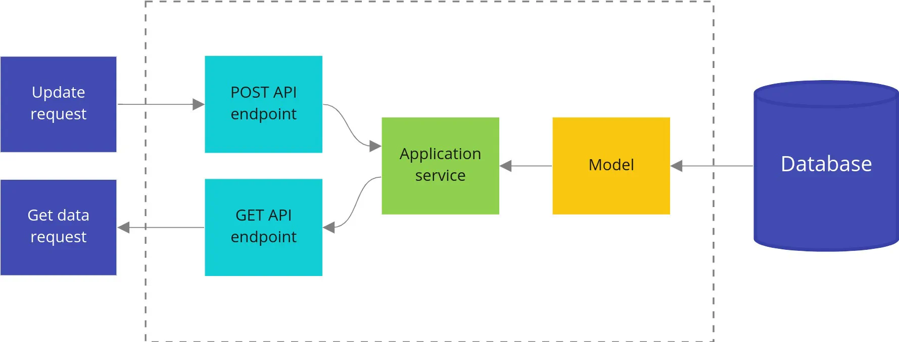
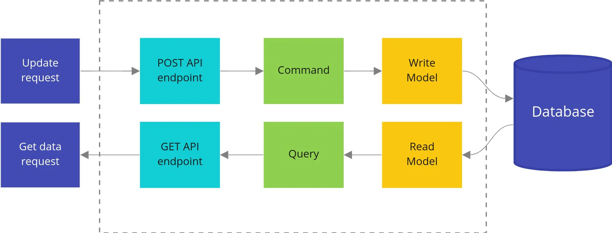

# Project Structure

## Standard, non-CQRS architecture

Bellow we have an example of a non cqrs architecture. 
In this example we have a single API that is responsible for reading and writing data from a database.



## CQRS architecture

Bellow we have an example of a cqrs architecture.
In this example we have two APIs, one for reading and another for writing data from a database.



### Command vs Query

- Command: A command is a request to change the state of the system. It is a request to perform an action.
- Query: A query is a request to get data from the system. It is a request to get information.

In short, a query should not modify anything, just return data.
A command should make changes in the system, but not return any data.
The objective is so that our queries can be cached more efficiently.

## Domain Driven Design

Domain-Driven Design (DDD) is a software design approach focused on modeling software based on the real-world domain, or business, it operates within. 
It promotes collaboration between developers and domain experts (people who deeply understand the business problem) to ensure that the software reflects the core business rules and processes.
DDD revolves around several key concepts that help structure complex software systems by breaking them into smaller, understandable parts that are aligned with the domain.

### Core Concepts of DDD

- **Domain:** Domain is the problem space the software is solving.

- **Ubiquitous Language:** Ubiquitous Language is a shared language between developers and domain experts that is used to describe the domain and the software that models it.

- **Entities:** Entities are objects that have a unique identity and are defined by their attributes.

- **Value Objects:** are objects that do not have an identity. An Address might be a value object. Two students can have the same address, but the address itself doesn’t have a unique identity.

- **Aggregates:** An aggregate is a cluster of related objects (entities and value objects) that are treated as a single unit for data changes. Aggregates ensure consistency by enforcing business rules across entities within the aggregate.

- **Repositories:** provide access to aggregates and entities. Instead of interacting directly with the database, the repository is responsible for fetching and storing aggregates.

- **Services:**  contain business logic that doesn’t naturally fit within an entity or aggregate. These services are part of the domain model and encapsulate important business behavior.

- **Factories:** are used to create complex objects or aggregates, especially when the creation process involves multiple steps or decisions.

----------------

## Folder structures

To represent our API, considering the class example, we will use the following folder structure:

```
.cmd 
├── api-class
├── api-student

.internal
├── api-class
        ├── commands
        ├── datamodel
                ├── migrations
        ├── domain
                ├── aggregates
                ├── entities
                ├── services
        ├── dto
             ├── requests
             ├── responses
        ├── errors
        ├── events
        ├── handlers
                ├── grpc
                ├── http
        ├── projection
        ├── queries
        ├── repository
        ├── service
├── api-student
    ...
```

### cmd folder

The `.cmd` folder contains the main entry point for the application. It is responsible for starting the application and initializing the necessary dependencies.
Its here where we will start our handlers like grpc and http or the database.

### internal folder

The `.internal` folder contains the core of the application. It is responsible for the business logic and the domain model.

#### /commands

The `commands` folder contains the commands that can be executed by the application, for example, to create delete or update
entities.

#### /datamodel

The `datamodel` folder contains the database schema and migrations.

#### /domain

The `domain` folder contains the domain model of the application. It contains the entities, aggregates and services.

- Inside the aggregates folder, we have the aggregates of the application. An aggregate is a cluster of related objects (entities and value objects) that are treated as a single unit for data changes.
We will have methods to create, update and delete the aggregate.

- Inside the entities folder, we have the entities of the application. An entity is an object that has a unique identity and is defined by its attributes. In our case, here we will define the interfaces that will be implemented in the services folder.

- Inside the services folder, we have the services of the application. Services contain business logic that doesn’t naturally fit within an entity or aggregate. These services are part of the domain model and encapsulate important business behavior.

#### /dto

The `dto` folder contains the data transfer objects (DTOs) that are used to transfer data between the layers of the application.

- Inside the requests folder, we have the requests DTOs. These are the objects that are used to transfer data from the client to the server.
- Inside the responses folder, we have the responses DTOs. These are the objects that are used to transfer data from the server to the client.

#### /errors

The `errors` folder contains the definition of some of the errors of the api.


#### /events

The `events` folder contains the events of the application that will affect the database.


#### /handlers

The `handlers` folder contains the handlers of the application. Handlers are responsible for handling the incoming requests and returning the responses.

- Inside the grpc folder, we have the grpc handlers. These are the handlers that are responsible for handling the incoming grpc requests and returning the responses.
- Inside the http folder, we have the http handlers. These are the handlers that are responsible for handling the incoming http requests and returning the responses.

#### /projection

The `projection` folder contains the projection of the application. It refers to the process of building or updating read models based on data changes that occur on the write side (commands). Projections are essentially data transformations that allow you to maintain optimized views of your data for efficient querying.


#### /queries

The `queries` folder contains the queries that can be executed by the application, calling the repository methods to do so.


#### /repository

The `repository` folder contains the repository of the application. Instead of interacting directly with the database, the repository is responsible for fetching and storing aggregates.